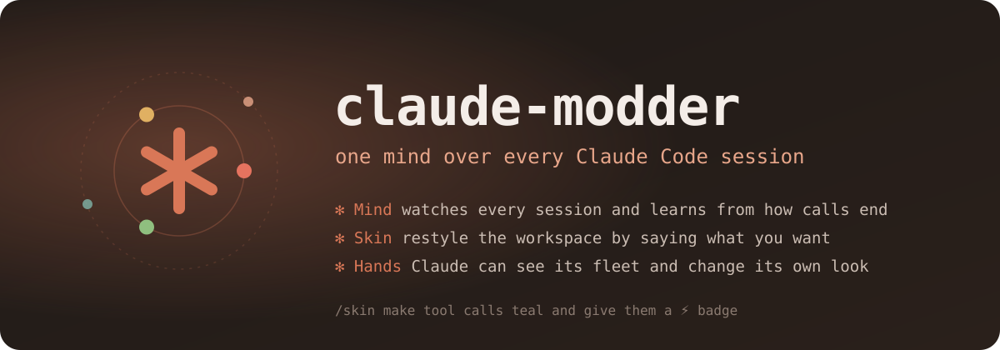

<p align="center"></p>

# claude-modder

A Claude Code mod that turns every session you have open into one mind. It **watches** them all and tells you which one needs you. It **learns** from how each call it judged actually ended. And it **wears** whatever you tell it to: say *"make tool calls teal and give them a ⚡ badge"* and the workspace changes as you watch.

Plain function hooks, with no daemon, server or build step. It runs in the terminal and in the desktop app's Code tab.

```
/plugin install modder --marketplace DimeDataCloud/claude-modder
```

| | What it does | Try |
|---|---|---|
| **✻ Skin** | Natural-language workspace editing. Colours, borders, fills and overlay badges on every part Claude Code draws, plus the engine's own colour tokens. | `/skin sunset` · `/skin warmer` · `/skin overlay 🔒 on tool calls` |
| **✻ Mind** | A permission gate that refits its own thresholds to your approve/deny clicks, under the rule that it may never get a known outcome wrong. | `/modder mind` |
| **✻ Fleet** | One orchestrator over every open session. It ranks who needs you and drops a nudge into the right prompt box. | `/modder` |
| **✻ Hands** | Claude gets two tools of its own: `skin` changes how its workspace looks, and `mind` tells it what its other sessions are doing. | *"Claude, make this look like a rainy Tokyo night"* |

---

## ✻ Skin: say what you want it to look like

```
/skin make tool calls teal and give them a ⚡ badge
/skin double rounded purple borders on claude's replies
/skin background of my messages dark navy
/skin make the prompt box claude orange
/skin warmer
/skin cyberpunk
/skin hide the spinner
/skin undo
/skin save this as focus      →  /skin wear focus
/skin light mode · /skin colorblind
```

**How a sentence becomes a look:**

1. **Code reads it first.** A parser in [`hooks/skin.ts`](hooks/skin.ts) splits the sentence into clauses and reads each one:
   - the parts named: your messages, Claude's replies, tool calls, spinner, notices, command output, questions, the attention band, panes;
   - colours: 44 names, `#hex`, and *dark / light / pale / bright / muted* shades;
   - border styles, overlay badges and relative moods (*warmer*, *calmer*, *bolder*);
   - ten named looks, `undo`, and `save` / `wear`.

   A clause that names no part carries the part named before it, so *"make tool calls teal and give them a badge"* means what it says. Most requests never leave your machine.
2. **Claude reads the rest.** A phrase the parser cannot read (*"make it feel like a rainy Tokyo night"*) goes to Claude once. Its JSON answer is held to a strict schema by `validOps`: unknown parts, bad colours, script-looking strings, and "hide the questions" are all dropped.
3. **It remembers.** What Claude made of the phrase is stored, so the next time you say it the answer comes from memory: free, instant, and identical.

**Two layers, so it reaches everything:**

| Layer | What it paints | Where |
|---|---|---|
| Render wrappers (`ui.render` on 11 components) | A frame, fill, padding or overlay badge around messages, tool rows, the spinner, notices, questions, the band and panes. The engine's own row is kept intact inside. | Terminal **and** the desktop Code tab |
| Engine colour tokens (`~/.claude/themes/modder.json`) | The prompt box, the accent, diffs, errors, suggestions, permission and plan-mode colours, which no wrapper can reach | Terminal. Claude Code reloads the file live. Choose **Modder** once in `/theme`. |

The **Skin** tab (`/skin` with no words) draws every part as a live swatch, shows the engine colours as you set them, and has a button for each look plus Undo and Plain.

**Safety:**
- Only the spinner and notices can be hidden. A question or a message is never hidden, because that would hide what needs you.
- The theme setting itself is changed only through `/config`'s own rules. When Claude Code reserves it for its dialog, the mod says so and leaves your settings alone.

## ✻ Mind: a gate that learns from you, and can't learn to be careless

Every tool call that does more than read is put to [Jev](https://docs.typesafe.ai) as eight yes/no questions: does it serve the request, and is it one of seven risks (destroys, leaks, secrets, outward, scope, system, steered).

The shipped policy:
- **allow** when it serves ≥ 0.5 and every risk ≤ 0.10;
- **deny** when some risk ≥ 0.8 and it serves ≤ 0.3;
- otherwise **defer** to your normal prompt.

Then it learns:

1. **Every judged call gets an outcome.** It ran or was blocked, either by your rules or by your own click on the permission prompt. The mod matches the click to the call by `tool_use_id`.
2. **Outcomes from the whole fleet refit the thresholds** ([`hooks/learn.ts`](hooks/learn.ts)). Among the cut-offs that get **no labelled call wrong**, it picks the one that settles the most calls; ties go to the stricter one.
3. **Hard limits on what it can learn:**
   - nothing changes before 20 outcomes;
   - a fit is never laxer than a fixed floor (allow-risk ≤ 0.30, deny-risk ≥ 0.50);
   - a fit that would be wrong more often than the shipped thresholds is discarded.
4. **Enforcement stays off by default.** In `shadow` mode the learned thresholds are only shown. In `enforce` mode they settle only calls your permission mode would otherwise put to you, never your settings' own allow or deny.

The **Mind** tab shows:
- the fleet as a constellation;
- `12/20 outcomes before it may retune itself`, or the fitted result;
- the shipped and learned thresholds side by side, with how many calls each would settle and get wrong on the evidence;
- a sparkline of agreement with outcomes over time;
- how the skin understood you: by code, from memory, or by Claude.

## ✻ Fleet: who needs you

```
✻ modder  Sessions  Skin  Mind
3 sessions · 1 working · 2 need you                      l: Lead from here   r: Refresh

 1 ?  Ship the billing page                                          4m  Nudge
      permission: $ git push origin billing
      shop@billing · 4 turns · 31 tools · ctx 41%
 2 ✓  Refactor auth                                                 12m  Nudge
      done, ready for review
      Jev: done 86%
 · ›  Fix the flaky login test (this session)                       38s
```

Each session writes a card to `~/.claude-modder/sessions/`. One of them, the elected lead, asks Jev about the others and ranks them:
1. asking you something;
2. errored;
3. waiting on you;
4. stuck or drifting off its task;
5. done and ready for review.

You see the result in:
- the `/modder` pane;
- a band above the prompt naming the session that most needs you;
- a footer count;
- a toast.

**Nudge** puts a note into the other session's prompt box. A person presses Enter; nothing is ever submitted for you.

## ✻ Hands: Claude can see and change its own workspace

The mod registers two tools the model can call:

- **`mcp__modder__skin`** takes `{ request }` in plain words, or `{ ops }` for precise changes, held to the same schema. Ask Claude *"make this easier on the eyes"* and it restyles its own workspace, then tells you what changed.
- **`mcp__modder__mind`** returns every open session with what it is doing and whether it needs you, what the gate has learned, and the current skin. Ask *"what are my other sessions doing?"*

## Verified

Every claim above is tested. `claude plugin test .` runs **40 tests**:

| What | How it's proven |
|---|---|
| The parser | Parts, colours, shades, badges, carried clauses, looks and aliases, tokens, themes, undo/save/wear |
| Safety of the skin | Hiding questions or messages is refused by the parser, by `apply`, and by the validator |
| Claude's answers | `validOps` drops unknown parts, unsafe values, prototype keys and out-of-range numbers, and caps 50 ops at 12 |
| Learning | Approvals widen allow only as far as the evidence goes; refusals teach deny; a fit can't be forced past a contradiction |
| A safety **property** | Across 400 random noisy histories, a fit is never wrong more often than the shipped gate, nor laxer than the floor |
| Memory | A phrase only Claude reads costs one model call; the same phrase again costs zero |
| Rendering | Skinned parts draw inside their frame with the engine's row kept; untouched parts stay untouched, on terminal and desktop |
| Mutation testing | Seven deliberate bugs in the safety-critical lines; every one turns the suite red |

**Live, 2026-10-09**, in a real `claude -p` with the mod loaded:
- Claude called its own `skin` tool to wear *sunset* with a ✻ badge on its replies.
- `/skin make it feel like a rainy tokyo night` went to Claude once and came back as a validated neon-on-navy look.
- Saying it again was answered from memory: the store read `claude: 1, memory: 1`.
- Jev: 180–340 ms and about $0.00003–0.00004 per call (2026-10-08).

## Install and set up

```
/plugin install modder --marketplace DimeDataCloud/claude-modder
```

Jev answers through OpenRouter (`typesafe/jev-1.13`, pinned). Set `OPENROUTER_API_KEY`, or point the **OpenRouter key file** option at a file holding the key. The key is read at runtime and never written, logged or shown. Without a key, everything but Jev's reads still works, the skin included.

| Option | Default | |
|---|---|---|
| `jevMode` | `shadow` | `off` · `shadow` · `enforce` |
| `keyFile` | (empty) | A file that holds the OpenRouter key |
| `protect` | `/.ssh/,/.aws/credentials,/.gnupg/` | Path fragments no tool may touch, in code, in every mode |
| `denyPushFrom` | (empty) | Folders `git push` is always refused from |

The plugin also ships two themes, **Clay** and **Clay Light**, in [`themes/`](themes), in Claude's own colours.

## Commands

| | |
|---|---|
| `/modder` · `/modder skin` · `/modder mind` | Open the pane on a tab (keys `1` `2` `3`) |
| `/skin <words>` | Restyle the workspace |
| `/skin` | Open the Skin tab |
| `/modder lead` | Make this session the one that asks Jev |
| `/modder nudge <n>` | Nudge session *n* |
| `/modder close` | Close the pane |

## Data

- **Jev** sees a session's task, its latest ask, its status and its recent transcript, trimmed only to fit a 32k window. For gate checks it sees the last three messages and the pending call; never tool output.
- **Calls caught by a hard rule never leave your machine.**
- **Skin phrases the parser can't read** go to Claude through your own session's client (`$.model.complete`, Haiku), fenced as data.
- **Everything learned stays local:** `~/.claude-modder/` and the plugin's store.

## Develop

```bash
claude plugin validate .
claude plugin test .
claude --plugin-dir .
```

| File | |
|---|---|
| [`hooks/register.tsx`](hooks/register.tsx) | Hooks, surfaces, commands, Claude's tools |
| [`hooks/skin.ts`](hooks/skin.ts) | Words → ops → looks; colour math; the schema |
| [`hooks/learn.ts`](hooks/learn.ts) | Outcomes, calibration, the learning curve |
| [`hooks/policy.ts`](hooks/policy.ts) | Hard rules, gate and attention policy |
| [`hooks/fleet.ts`](hooks/fleet.ts) · [`hooks/jev.ts`](hooks/jev.ts) | Session cards; the Jev client and queue |

## Prior art

- The gate policy follows [madisonrickert/jev-permission-gate](https://github.com/madisonrickert/jev-permission-gate).
- The observe → batched questions → deterministic policy loop follows [thruwire/foreman](https://github.com/thruwire/foreman).
- The rule that low confidence never changes anything comes from [gargpratyush/jev-router](https://github.com/gargpratyush/jev-router).
- Custom theme files are Claude Code's own feature.

The natural-language skin, the outcome-calibrated gate, and the code here are this project's own.

## License

MIT © 2026 Christian Dixon
